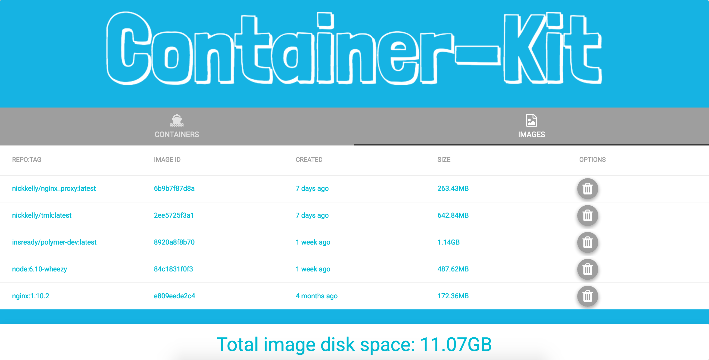
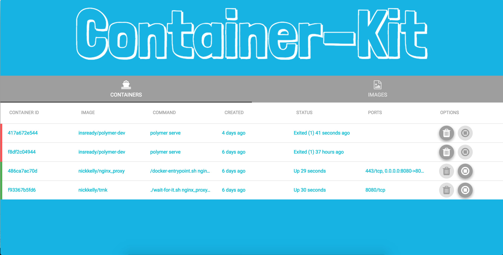

# container-kit

    git clone git@github.com:Tivix/container-kit.git
    cd container-kit
    npm install

## Dev

Run each command in separate terminal:

    npm run watch
    npm run start

## App use

    npm run build

That will create a folder `ContainerKit-{arch}-{cpu}` which contains `ContainerKit` application.

*only compatible with OSX devices for app use

:whale::whale::whale::whale::whale::whale::whale::whale::whale::whale::whale::whale::whale:
